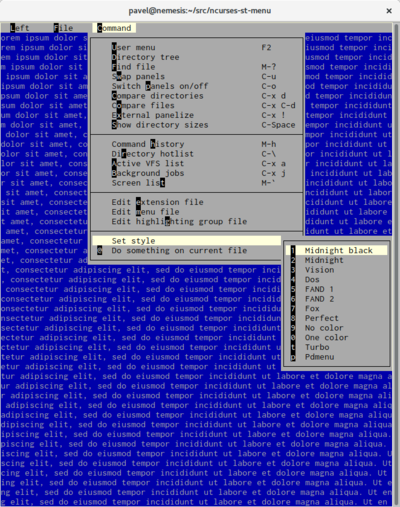
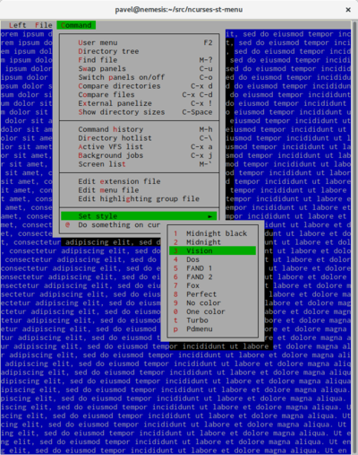
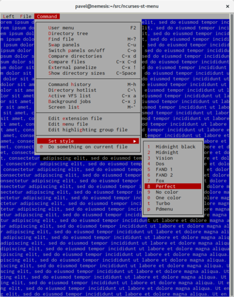
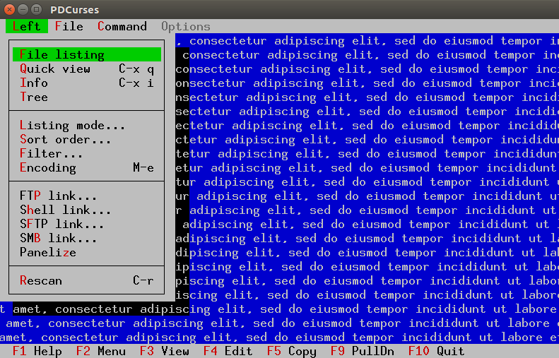

# ncurses-st-menu 

modern and simple ncurses/PDCurses based library for CUA look menu

I didn't find any library for Unix terminal applications for creating pull down and menu bar menus. 
My short target is library for menu with midnight commander look. The origin ncurses menu are not designed
for CUA applications, and cannot be used for these types of applications. This is library - small library.
It does only pulldown menus and menubars, nothing else. It is not complex framework with thousand functions.

# Features

* CUA look pulldown and menu bar support

* Support inner accelerator ~x~ and outer accelerator _x_

* Menubar are accessable via Alt x accelerators

* Nested pulldown menu are suppported

* Possible to set style (14 attributes, 12 styles are prepared)

* Possible to set shadow around pulldown menu

* Mouse is supported

* Possible serialize and load state of menu objects

* The usage pattern is close to original ncurses `menu` library. A menudata are
  created by functions `st_menu_new` or `st_menu_new_menubar`. A function `st_menu_post`
  displays menu, and function `st_menu_unpost` hides menu. Any event can be processed
  in menu library by function `st_menu_driver` and menu can be removed by function 
  `st_menu_free`.

* Compatible with PDCurses (offers Windows support--among others)

# Screenshots







# Building Libraries/Demos

Use the following to build for ncurses.  (PDCurses specific build information is detailed later in this document)
```
./autogen.sh
./configure
make
```

NOTE: To generate a debug build append `--enable-debug` to the configure statement.

Creates `demoapp` and `demoapp_sl`. `demoapp_sl` uses shared library - and it can be executed by
`LD_LIBRARY_PATH=. /.demoapp_sl`. Note: when you doesn't modify `LD_LIBRARY_PATH`, you should
to run `make install` for correct behave of `demoapp_sl` (demo with shared library).

`Command|Set style` submenu is active - you can change styles interactivly.

When there are no `ncursesw` library, then modify Makefile and replace `ncursesw` by `necurses`,
and remove `-DNCURSES_WIDECHAR=1`.

## Clean Build

To remove all built objects/executable/etc run:

```
make clean
```

To remove the files created by the autotools:

```
make cleanconfig
```

# Usage
```C
#ifdef HAVE_LANGINFO_CODESET
#include <langinfo.h>
#endif
#include <locale.h>
#include "st_curses.h"
#include "st_panel.h"
#include <string.h>
#include <unicase.h>

#include "st_menu.h"

/*
 * Read event. When event is mouse event, read mouse data
 */
static inline int
get_event(MEVENT *mevent, bool *alt)
{
	bool	first_event = true;
	int		c;

	*alt = false;

repeat:

	c = getch();

	/*
	 * Read mouse event when it is possible. Do it now, before st_meny_driver call,
	 * as protection to unwanted multiple call of getmouse function. For one mouse
	 * event, it returns data only once time.
	 */
	if (c == KEY_MOUSE)
	{
		int ok = getmouse(mevent);

		if (ok != OK)
			goto repeat;
	}

	if (c == ST_MENU_ESCAPE)
	{
		if (first_event)
		{
			first_event = false;
			goto repeat;
		}
	}

	*alt = !first_event;

	return c;
}

/*
 * Application demo
 */
int
main()
{
	PANEL *mainpanel;
	ST_MENU_CONFIG  config;
	ST_MENU_ITEM		   *active_item;
	struct ST_MENU *menu;
	bool	activated;
	int		c;
	MEVENT	mevent;
	bool	alt;

	ST_MENU_ITEM _file[] = {
		{"E~x~it", 34, "Alt-x"},
		{NULL, -1, NULL}
	};

	ST_MENU_ITEM menubar[] = {
		{"~F~ile", 61, NULL, 0, _file},
		{NULL, -1, NULL}
	};

	setlocale(LC_ALL, "");

    #ifdef HAVE_LANGINFO_CODESET
	/* Don't use UTF when terminal doesn't use UTF */
	config.encoding = nl_langinfo(CODESET);
	#else
	config.encoding = "";
	#endif

#ifdef LIBUNISTRING

	config.language = uc_locale_language();

#else

	config.language = NULL;

#endif
    
	config.force8bit = strcmp(config.encoding, "UTF-8") != 0;

	initscr();
	start_color();
	clear();
	cbreak();
	noecho();
	keypad(stdscr, TRUE);

#ifdef NCURSES_EXT_FUNCS

	set_escdelay(25);

#endif

	refresh();

	init_pair(1, COLOR_WHITE, COLOR_BLUE);

	/* load style, possible alternatives: ST_MENU_STYLE_MC, ST_MENU_STYLE_DOS */
	st_menu_load_style(&config, ST_MENU_STYLE_VISION, 2);

	mousemask(BUTTON1_PRESSED | BUTTON1_RELEASED, NULL);
	mouseinterval(0);

	/* prepare main window */
	wbkgd(stdscr, COLOR_PAIR(1));
    wclear(stdscr);
	wrefresh(stdscr);

	/*
	 * main window should be panelized. Only panels can be
	 * overlapped without unwanted effects.
	 */
	mainpanel = new_panel(stdscr);
	st_menu_set_desktop_panel(mainpanel);

	/* prepare state variable for menubar */
	menu = st_menu_new_menubar(&config, menubar);

	/* post meubar (display it) */
	st_menu_post(menu);

	c = get_event(&mevent, &alt);

	refresh();

	while (1)
	{
		bool	processed = false;

		processed = st_menu_driver(menu, c, alt, &mevent);

		doupdate();

		active_item = st_menu_selected_item(&activated);
		if (processed && activated)
		{
			/* here is processing of menucode related to Exit menu item */
			if (active_item->code == 34)
				break;
		}

		if (!processed && alt && c == 'x')
			break;

		/* get new event */
		c = get_event(&mevent, &alt);
	}

	endwin();

	st_menu_unpost(menu, true);
	st_menu_free(menu);

	return 0;
}
```

# Dependency

* optional libunistring - LGPL Unicode library

* define NCURSES_WIDECHAR when wide char ncurses support is available.


# PDCurses


## Building PDCurses

This is a simple overview on building PDcurses from source.  For the latest info refer to the README files for each build directory/type.

### X11

```
cd PDCurses/x11
./configure
make
```

### wincon (Windows Console)

Building with MinGW using MSys

```
cd PDCurses/wincon
set PDCURSES_SRCDIR=c:\tmp\PDCurses
make DLL=Y
```

NOTE: To clean the build you will need to run `rm *.o *.dll *.a` since `make clean` was written expecting to run from a Windows Console (i.e. uses DEL).


## Building for PDCurses

To build for PDCurses you first need some added agruments for the `configure` prior to the make.  The configure options are defined as:

**PDCURSES_INSTALL**    If you have the PDCurses libs/headers installed you can 
                        simply use just this flag.  The other options will be
                        filled in for you.  Currently support: "x11"
                        NOTE: Other arguments not needed.                  <br>
**PDCURSES_INCDIR**     Directory containing the curses/panel headers      <br>
**PDCURSES_LIBDIR**     Directory containing the PDCurses library          <br>
**PDCURSES_LIB**        Name of the PDCurses library, defaults to 'libXCurses' (Linux), 'pdcurses' (Windows) <br>
**PDCURSES_DEP_LIBS**   List of the PDCurses dependant library (exclude PDCURSES_LIB).           <br>
 
NOTE: If you are pointing to the PDCurses github directory built for
      a specific OS/terminal you can omit the PDCURSES_INCDIR.

### Windows Requirements

Built using MinGW from MSys.  Install the following:
- pacman -S mingw-w64-x86_64-pkg-config
- pacman -S automake autoconf

### Examples

This example builds from installed PDCurses for Linux X11:                <br>
NOTE: The build tools will setup all the other `PDCURSES_xxx` arguments for us.

```
./autogen.sh
PDCURSES_INSTALL=x11 ./configure
make
```

This example builds from PDCurses source for Linux X11:                   <br>
NOTE: PDCURSES_LIB defaults to `libXCurses` so we don't need to specify it

```
./autogen.sh
PDCURSES_LIBDIR=/home/username/github/PDCurses/x11 ./configure
make
```

This is a complete example (ignores the fact that some variables are not needed):
```
./autogen.sh
PDCURSES_LIBDIR=/home/username/github/PDCurses/x11 \
PDCURSES_INCDIR=/home/username/github/PDCurses \
PDCURSES_LIB=libXCurses \
PDCURSES_DEP_LIBS=Xaw Xmu Xt X11 Xpm SM ICE Xext \
./configure
make
```

This example builds from PDCurses source for Windows:

```
./autogen.sh
PDCURSES_LIBDIR=/c/tmp/PDCurses/wincon ./configure
make
```

NOTE: To generate a debug build append `--enable-debug` to the configure statement.


## Screenshots

PDCurses Ubuntu 16.04 X11 



## PDCurses Tested:

- Ubuntu 16.04, PDCurses X11
- Windows 10, PDCurses wincon
  - Build with MSys/MinGW

# Note

If you like it, send a postcard from your home country to my address, please:

    Pavel Stehule
    Skalice 12
    256 01 Benesov u Prahy
    Czech Republic


I invite any questions, comments, bug reports, patches on mail address pavel.stehule@gmail.com
