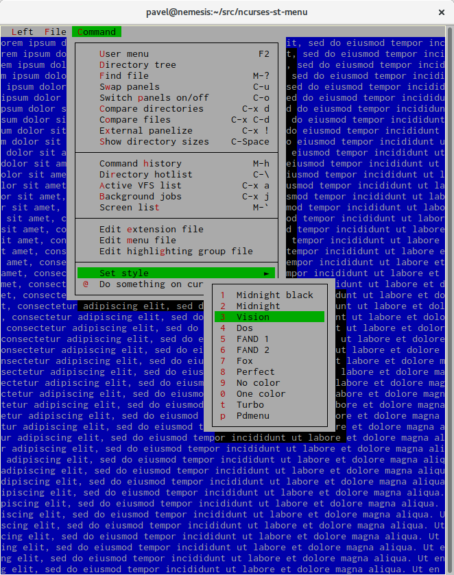
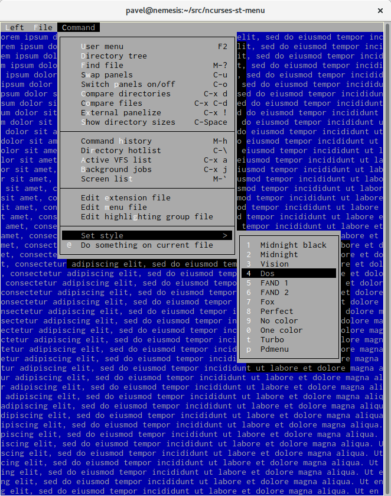

# ncurses-st-menu 

ncurses based library for CUA look menu

I didn't find any library for Unix terminal applications for creating pull down and menu bar menus. 
My short target is library for menu with midnight commander look. The origin ncurses menu are not designed
for CUA applications, and cannot be used for these types of applications.

# Features

* CUA look pulldown and menu bar support

* Support inner accelerator ~x~ and outer accelerator _x_

* Menubar are accessable via Alt x accelerators

* Nested pulldown menu are suppported

* Possible to set style (14 attributes, 12 styles are prepared)

* Possible to set shadow around pulldown menu

* Mouse is supported

* Possible serialize and load state of menu objects

* The usage pattern is close to original ncurses `menu` library. A menudata are
  created by functions `st_menu_new` or `st_menu_new_menubar`. A function `st_menu_post`
  displays menu, and function `st_menu_unpost` hides menu. Any event can be processed
  in menu library by function `st_menu_driver` and menu can be removed by function 
  `st_menu_delete`.

# Screenshots

<!-- .element height="50%" width="50%" -->
<!-- .element height="50%" width="50%" -->
<!-- .element height="50%" width="50%" -->
<!-- .element height="50%" width="50%" -->

# Demo

    make
    ./demo

Creates `demo` and `demo_sl`. `demo_sl` uses shared library - and it can be executed by
`LD_LIBRARY_PATH=. /.demo_sl`.

`Command|Set style` submenu is active - you can change styles interactivly.

When there are no `ncursesw` library, then modify Makefile and replace `ncursesw` by `necurses`,
and remove `-DNCURSES_WIDECHAR=1`

# Dependency

* libunistring - LGPL Unicode library

* define NCURSES_WIDECHAR when wide char ncurses support is available.

# Note

If you like it, send a postcard from your home country to my address, please:

    Pavel Stehule
    Skalice 12
    256 01 Benesov u Prahy
    Czech Republic

I invite any questions, comments, bug reports, patches on mail address pavel.stehule@gmail.com
